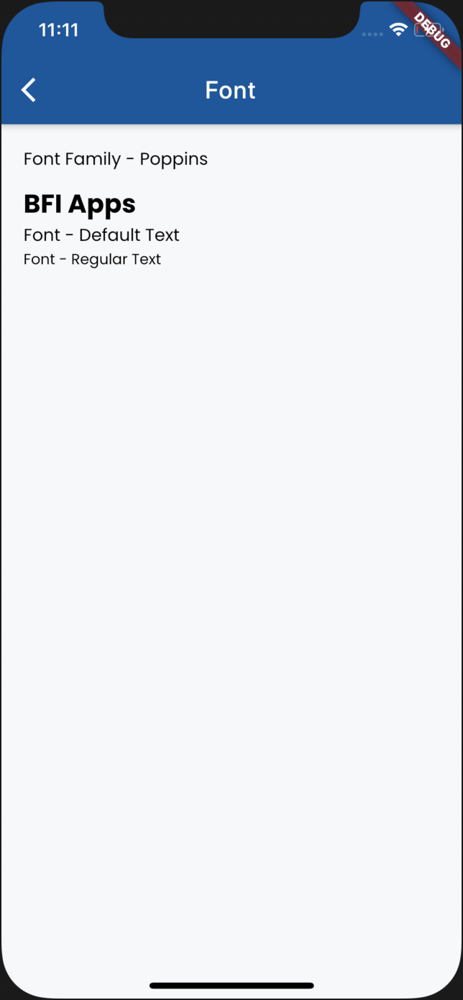
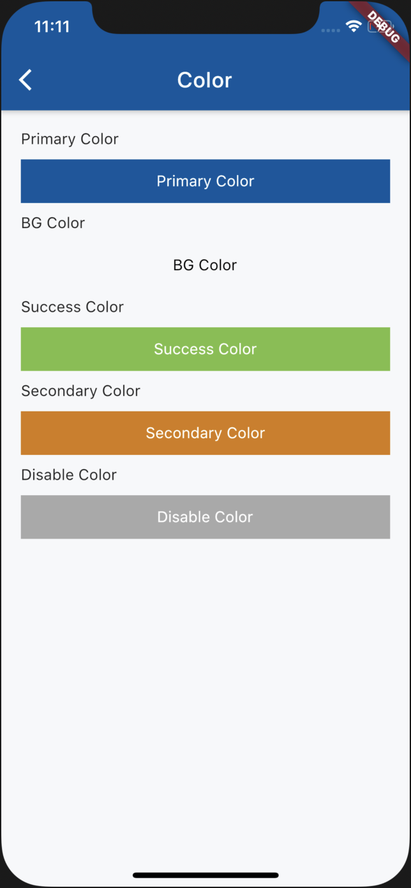
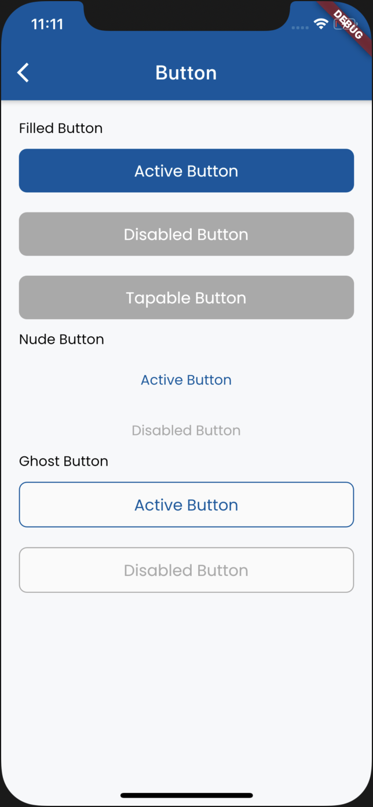
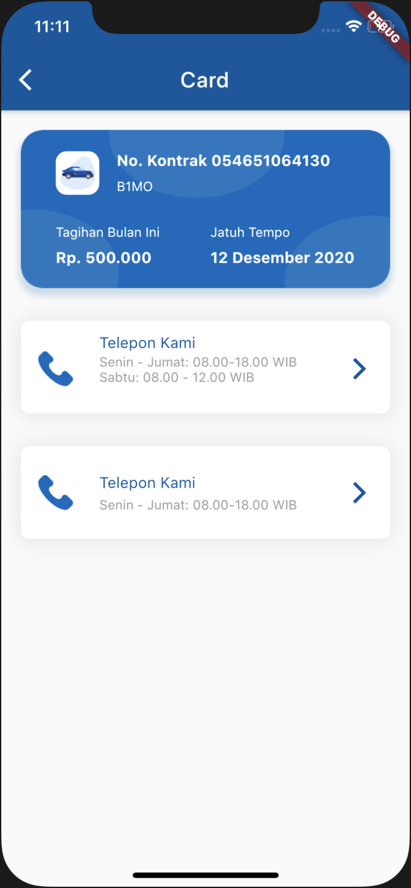

# flutter_ds_bfi

Design System Package for BFI

## Getting Started

This project is a starting point for a Dart
[package](https://flutter.dev/developing-packages/),
a library module containing code that can be shared easily across
multiple Flutter or Dart projects.

For help getting started with Flutter, view our 
[online documentation](https://flutter.dev/docs), which offers tutorials, 
samples, guidance on mobile development, and a full API reference.

## Example for DSText & FontFamily


### How to use ?
Just add this syntax to used DSText
```dart
DSText(
                  data: 'Font Family - Poppins',
                  textStyle: TextStyle(
                    fontFamily: DSFont.Poppins,
                    color: Colors.black,
                  ),
                )
```
And this is the stlye
```dart
class DSTextStyle {
  static const TextStyle defaultStyle = TextStyle(
      fontSize: 14.0,
      fontFamily: DSFont.Poppins,
      color: Colors.black,
      fontWeight: FontWeight.normal);

  static const TextStyle regularStyle = TextStyle(
      fontSize: 12.0,
      fontFamily: DSFont.Poppins,
      color: Colors.black,
      fontWeight: FontWeight.normal);

  static const TextStyle titleTextStyle = TextStyle(
      fontSize: 21.0,
      fontFamily: DSFont.Poppins,
      color: Colors.black,
      fontWeight: FontWeight.bold);
}
```

## Example for DSColor


### How to use ?
Just add this syntax to used DSColor
```dart
buildTileColor(
                    "Primary Color", DSColor.primaryBlue, Colors.white),
```
And this is list of Color
```dart
Class DSColor {
  DSColor._();

  static const Color primaryBlue = Color(0xFF04559f);
  static const Color bgColor = Color(0xFFf7f8fa);
  static const Color successGreen = Color(0xFF7ac143);
  static const Color secondaryOrange = Color(0xFFd47c0a);
  static const Color disableColor = Color(0xFFA9A9A9);
}
```

## Example for DSButton


### How to use ?
Just add this syntax to used DSButton. Example Active Button 
```dart
DSFilledButton(
                  text: "Active Button",
                  fontSize: 16,
                  buttonState: DSButtonState.Active,
                  fontWeight: FontWeight.normal,
                  onTap: () {},
                )
```
And this is list of Button State
```dart
enum DSButtonState { Active, Disable, Tapable, Ghost, GhostDisable }
```

## Example for DSCard


### How to use ?
Just add this syntax to used DSCard. Example Blue Card 
```dart
DSCard(
              angsuranPerBulan: Text(
                'Rp. 500.000',
                style: TextStyle(
                  fontSize: 14,
                  color: Colors.white,
                  fontWeight: FontWeight.bold,
                ),
              ),
              jatuhTempo: Text('12 Desember 2020',
                  style: TextStyle(
                      fontSize: 14,
                      color: Colors.white,
                      fontWeight: FontWeight.bold)),
              licensePlate: 'B1MO',
              noKontrak: '054651064130',
              bgCard: 'assets/imgs/card_blue.png',
              icon: 'assets/imgs/mobil.png',
              titleAngsuran: 'Tagihan Bulan Ini',
              arrowUp: 'assets/imgs/arrow_up_white.png',
              onTap: () {
                print('tap tap tap');
              },
            )
```
Just add this syntax to used DSCard. Example Contact Us 
```dart
  DSCardContactUs(
                image: 'assets/imgs/phone_call.png',
                title: 'Telepon Kami',
                subtitle: 'Senin - Jumat: 08.00-18.00 WIB',
                subtitle2: 'Sabtu: 08.00 - 12.00 WIB')
```


